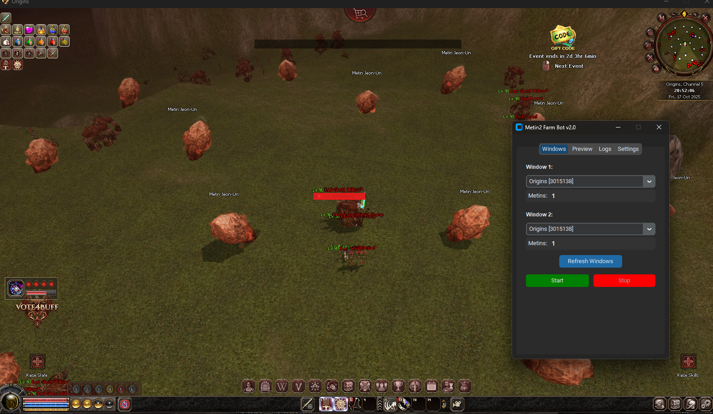
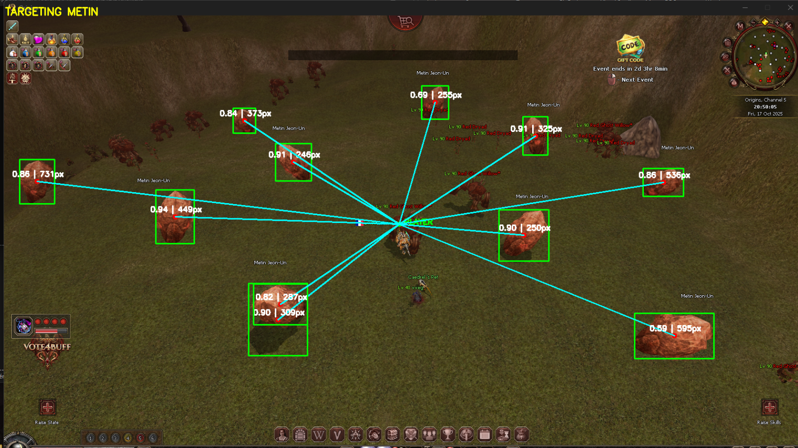

# Metin2 Farming Bot

An advanced AI-powered farming bot for Metin2, primarily designed for **Origins2** server but adaptable to any Metin2 server. Uses YOLOv8 deep learning for intelligent metin stone detection and automated farming.


*Before: Raw game view*


*After: AI-powered metin detection with bounding boxes*

---

## ✨ Features

### 🤖 AI-Powered Detection
- **YOLOv8 Deep Learning Model** - Advanced computer vision for accurate metin stone detection
- **GPU Acceleration (CUDA)** - Lightning-fast inference with NVIDIA GPU support, falls back to CPU automatically
- **Smart Filtering** - Size and color-based filtering to eliminate false positives (monsters, NPCs, objects)
- **Confidence Scoring** - Adjustable detection confidence thresholds for precision control

### 🎯 Intelligent Targeting
- **Nearest Target Selection** - Automatically targets the closest metin stone to your character
- **Distance Calculation** - Real-time distance measurement for optimal targeting
- **Target Locking** - Prevents target switching during combat cooldowns
- **Click Cooldown System** - Configurable delays to prevent rapid clicking issues

### 🔄 Advanced Recovery Systems
- **Stuck Detection & Recovery** - Multiple recovery strategies for various stuck conditions:
  - Wrong target detection and correction
  - Camera rotation for finding new targets
  - Movement-based unstuck mechanisms
  - Automatic F1 key recovery
- **Kill Duration Monitoring** - Detects when metin takes too long to kill and switches targets
- **Focus Failure Handling** - Multi-strategy window focusing with retry mechanisms

### 🎮 Multi-Window Support
- **Dual Window Management** - Farm on two game clients simultaneously
- **Thread-Safe Operations** - Global input lock prevents action bleeding between windows
- **Independent Bot Workers** - Each window operates with its own detection and action pipeline
- **Per-Window Logging** - Separate logs and counters for each game instance

### 💎 Auto-Loot System
- **Continuous Looting** - Fixed 0.5s interval for 24/7 loot collection
- **Configurable Burst Mode** - Adjustable burst loot count and timing
- **Lightweight Operation** - Minimal performance impact on main bot loop

### 🖼️ Template Matching
- **Game State Detection** - Uses OpenCV template matching for:
  - Selected metin indicator
  - False metin detection
  - Target lock indicator
  - Full HP metin detection
- **Adjustable Confidence** - Fine-tune matching thresholds for different game resolutions

### 📸 Debug & Monitoring
- **Screenshot Capture** - Optional screenshot saving with detection annotations
- **Real-time Visualization** - Bounding boxes, confidence scores, and distance measurements
- **Live Frame Preview** - GUI displays current detection state for both windows
- **Detailed Logging** - Timestamped logs with window-specific events

### ⚙️ Highly Configurable
- **GUI Settings Panel** - Easy-to-use interface for all bot parameters
- **Timing Adjustments** - Fine-tune delays for clicks, movements, rotations, and key presses
- **Detection Filters** - Customize size, area, and color thresholds
- **Hotkey Support** - Configurable global hotkey for quick bot start/stop
- **JSON Configuration** - Settings persist between sessions

### 🛡️ Safety Features
- **Administrator Privileges** - Automatic elevation for reliable input control
- **Window Focus Management** - Aggressive multi-strategy focusing to prevent input loss
- **Thread Locking** - Prevents race conditions and input conflicts
- **Graceful Error Handling** - Continues operation even when individual actions fail

---

## 🚀 Quick Start

### Prerequisites
- Windows OS (uses Win32 API for window capture and input)
- Python 3.8+
- NVIDIA GPU with CUDA support (optional, but recommended for best performance)

### Installation

1. **Clone the repository**
```bash
git clone https://github.com/yourusername/metin2-farm-bot.git
cd metin2-farm-bot
```

2. **Install dependencies**
```bash
pip install -r requirements.txt
```

3. **Run the bot**
```bash
python metin2_farm_bot.py
```
Or simply double-click `run_bot.bat`

### First Time Setup

1. **Launch the bot** - It will automatically request administrator privileges
2. **Configure settings** - Adjust detection confidence and timing in the Settings tab
3. **Select game windows** - Choose your Metin2 client windows from the dropdowns
4. **Start farming** - Click "Start Bot" or use the configured hotkey (default: `:`)

---

## 📋 Configuration

### Model Settings
- **Model Path** - Select your trained YOLOv8 model (`.pt` file)
- **Model Confidence** - Detection confidence threshold (0.0 - 1.0)

### Template Matching
- **Selected Metin Confidence** - Threshold for selected metin indicator
- **False Metin Confidence** - Threshold for false metin detection
- **Target Confidence** - Threshold for target lock indicator
- **Full HP Metin Confidence** - Threshold for full HP metin detection

### Timing Settings
- **Click Cooldown** - Delay between target clicks (prevents spam)
- **Post Kill Delay** - Wait time after killing before next target
- **Max Kill Duration** - Maximum time to spend on one metin before switching
- **Mouse Movement Delay** - Delay after moving mouse before clicking
- **Rotation Intervals** - Camera rotation timing for searching

### Detection Filters
- **Min Metin Width/Height** - Minimum dimensions to filter small objects
- **Min Metin Area** - Minimum bounding box area
- **Color Filter Threshold** - Percentage of metin-colored pixels required
- **Use Color Filter** - Enable/disable color-based filtering

### Auto-Loot
- **Enable Auto-Loot** - Toggle continuous looting
- **Loot Interval** - Delay between loot attempts
- **Burst Loot Count** - Number of rapid loot attempts per cycle

---

## 🎯 Adapting to Other Servers

While optimized for **Origins2**, this bot can be adapted to any Metin2 server:

1. **Update Template Images** - Replace images in the `Images/` folder with your server's UI elements:
   - `selectedmetin.png` - Selected metin indicator
   - `falsemetin.png` - False metin indicator
   - `target.png` - Target lock indicator
   - `FullhpMetin.png` - Full HP metin indicator
2. **Adjust Confidence Thresholds** - Fine-tune detection settings for your server's graphics
3. **Modify Timing** - Adjust delays based on your server's response times

---

## 📁 Project Structure

```
metin2-farm-bot/
├── metin2_farm_bot.py      # Main bot application
├── bot_settings.json        # Configuration file
├── requirements.txt         # Python dependencies
├── run_bot.bat             # Windows launcher
├── models/                 # YOLOv8 model files
│   ├── best.pt
│   ├── valium_idle_metiny_yolov8s.pt
│   └── ...
├── Images/                 # Template matching images
│   ├── selectedmetin.png
│   ├── falsemetin.png
│   ├── target.png
│   └── FullhpMetin.png
├── assets/                 # README assets
│   ├── before.png
│   └── after.webp
└── screenshots/            # Debug screenshots (optional)
```

---

## 🖥️ System Requirements

### Minimum
- Windows 7/8/10/11
- Python 3.8+
- 4GB RAM
- Dual-core CPU
- Integrated graphics

### Recommended
- Windows 10/11
- Python 3.10+
- 8GB+ RAM
- Quad-core CPU
- NVIDIA GPU with CUDA support (GTX 1050 or better)

---

## ⚠️ Disclaimer

This bot is for **educational purposes only**. Using automation tools may violate the Terms of Service of Metin2 servers and could result in account suspension or ban. Use at your own risk.

---

## 📝 License

This project is open source and available under the MIT License.

---

## 🙏 Acknowledgments

- **Ultralytics** - YOLOv8 framework
- **OpenCV** - Computer vision library
- **CustomTkinter** - Modern GUI framework
- **Origins2 Community** - Testing and feedback

---

**Happy Farming! 🎮⚔️💎**
